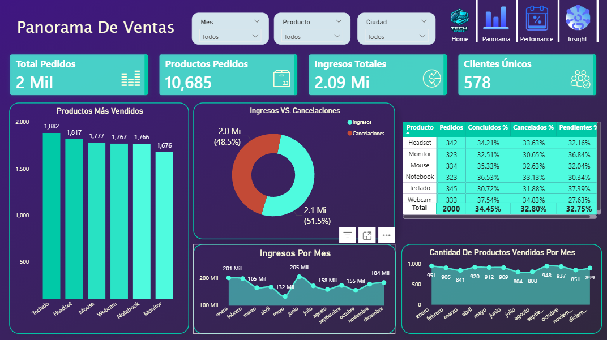
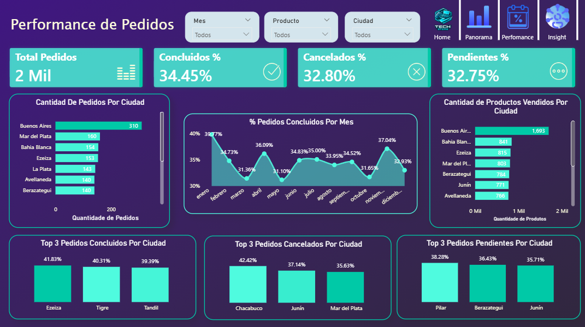

#  Dashboard de análisis de performance de ventas utilizando datos ficticios en Power BI.

Podés acceder al reporte completo en este enlace:

Este proyecto forma parte de mi portafolio y simula el tipo de problemas reales que los datos bien estructurados ayudan a resolver en el día a día.
El panel fue diseñado para ir más allá de “qué pasó” y mostrar dónde actuar.

## 

## 

## 

## Principales insights:

1. Las cancelaciones consumen un tercio de los ingresos potenciales
 El 32,8% de los pedidos fueron cancelados, generando una pérdida estimada de USD 2 millones en el período.

2. Los pedidos pendientes parecen alimentar el problema
 El 32,7% de los pedidos permanece pendiente, lo que sugiere cuellos de botella entre la venta y la finalización.

3. Los headsets colapsan en el primer trimestre
 Las ventas de headsets en feb–mar están un 53% por debajo del promedio mensual. Producto estratégico con una ventana clara de oportunidad.
